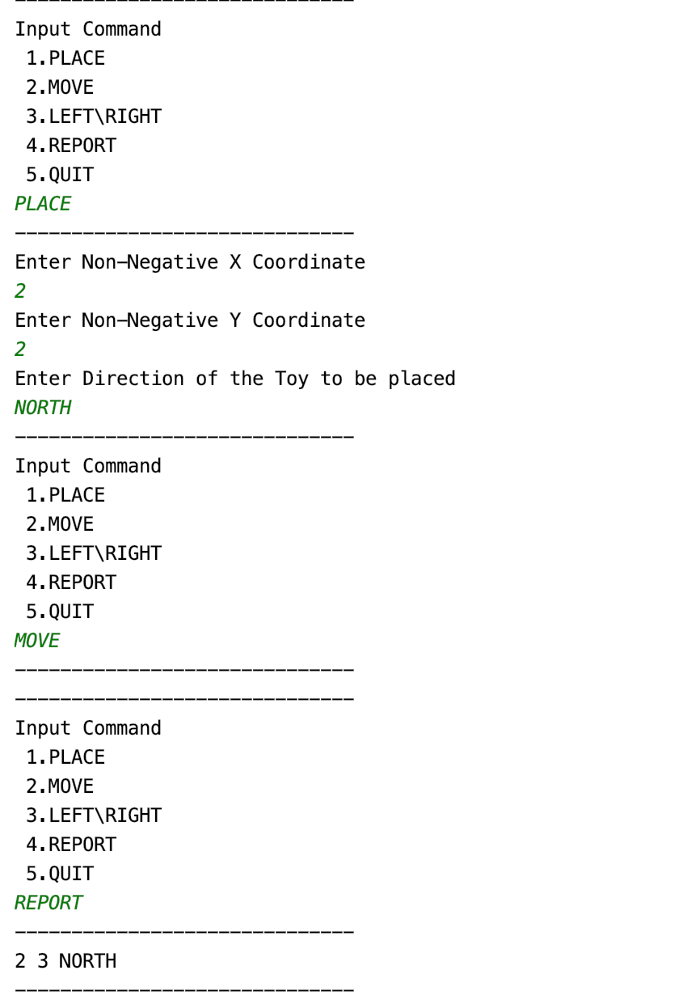

# Toy-Robot
The solution to the Toy Robot problem statement is solved using Python 3.7.

To run the application, please follow the below steps:

Go to the application folder using command line.
Run : python toy_robot.py
Enter the Commands

To run the test cases:

Run : python toy_robot_test.py

# Assumptions

1. The input commands should always be in CAPITALS.
2. There are no obstructions on the table
3. The diagonals of the table are (0,0) and (4,4) i.e 5x5
